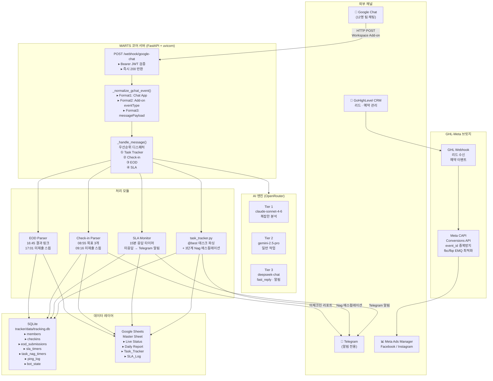
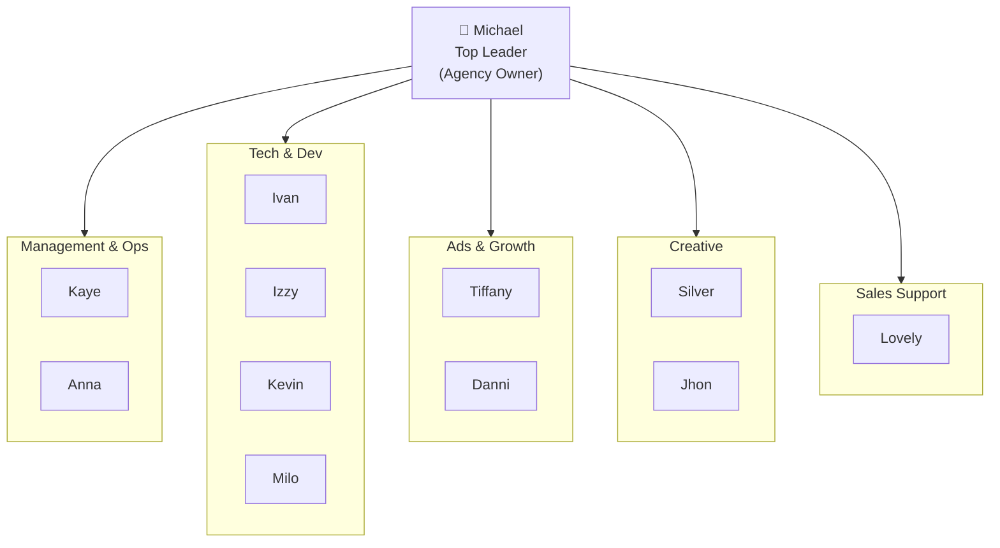
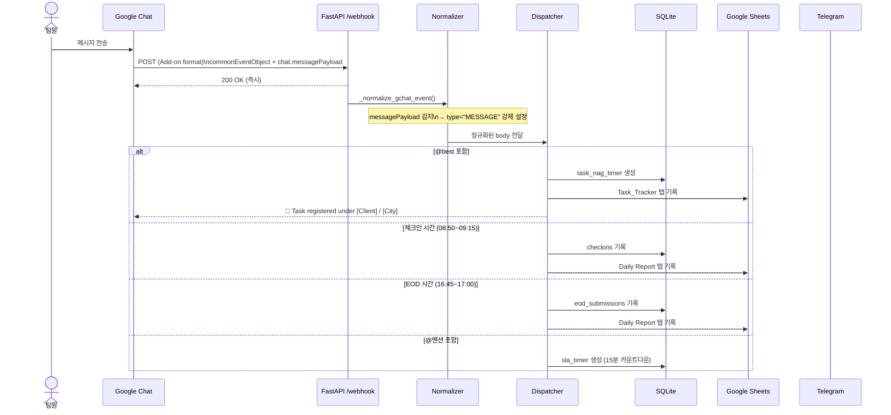
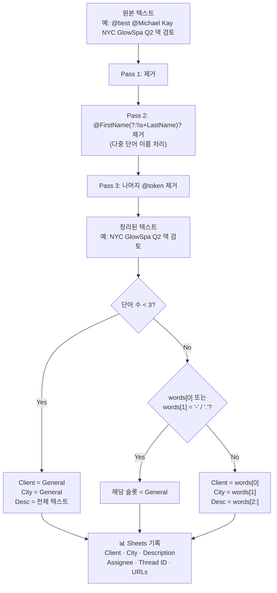
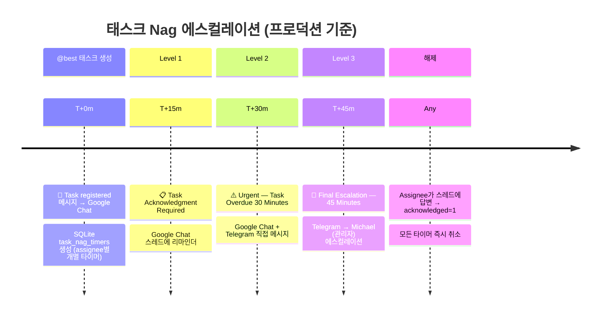
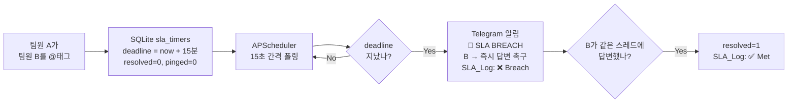
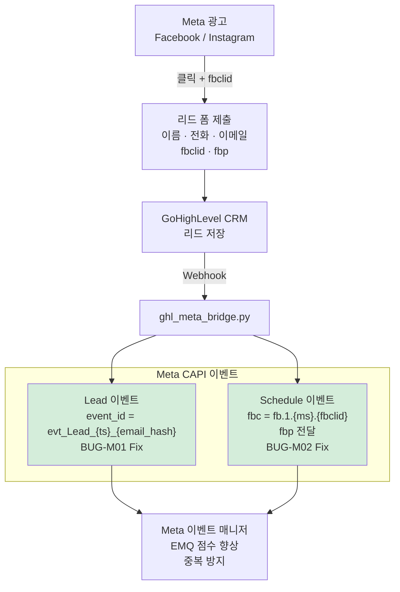
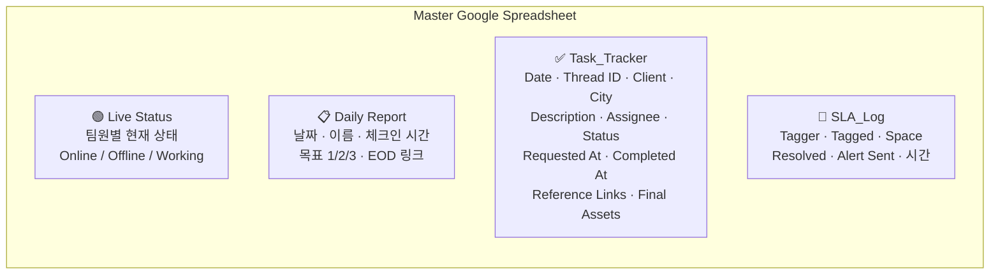
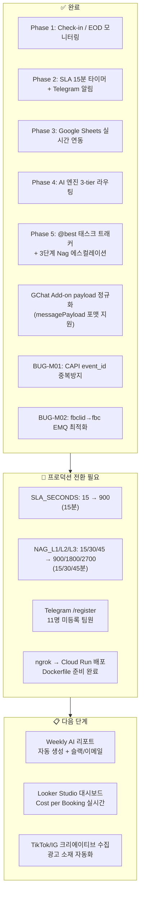

# MARTS — Marketing Agency Remote Tracking System
## 최종 기획서 v1.0 | 2026-04-20

---

## 1. 시스템 전체 구조



---

## 2. 팀 구조 (12명)



---

## 3. Google Chat 메시지 처리 흐름



---

## 4. @best 태스크 트래커 파싱 로직



---

## 5. Nag 에스컬레이션 타임라인



---

## 6. SLA 모니터링 흐름



---

## 7. GHL-Meta 브릿지 데이터 흐름



---

## 8. Google Sheets 탭 구조



---

## 9. 스케줄러 타임라인 (평일 기준, Asia/Manila)

```mermaid
gantt
    title 일일 자동화 스케줄 (PHT UTC+8)
    dateFormat HH:mm
    axisFormat %H:%M

    section 체크인
    체크인 프롬프트 전송       :milestone, 08:55, 0m
    체크인 수신 윈도우         :active, 08:50, 25m
    미체크인 스윕 + Telegram   :milestone, 09:16, 0m

    section EOD
    EOD 프롬프트 전송          :milestone, 16:45, 0m
    EOD 수신 윈도우            :active, 16:45, 15m
    미EOD 스윕 + Telegram      :milestone, 17:01, 0m

    section 상시 폴링
    SLA 타이머 체크 (15초)     :active, 00:00, 1440m
    Nag 타이머 체크 (15초)     :active, 00:00, 1440m
```



---

## 10. 기술 스택 요약

| 레이어 | 기술 | 용도 |
|---|---|---|
| **웹 서버** | FastAPI + uvicorn | Webhook 수신, 즉시 200 반환 |
| **스케줄러** | APScheduler (BackgroundScheduler) | Cron + 15초 interval 폴링 |
| **DB** | SQLite | 팀원 · 체크인 · SLA · 태스크 타이머 |
| **Google Chat** | Workspace Add-on HTTP endpoint | 메시지 수신 (messagePayload 포맷) |
| **Telegram** | pyTelegramBotAPI | 알림 전용 (SLA · Nag · 미체크인) |
| **Google Sheets** | gspread + google-auth | Live Status · Daily · Task · SLA 로그 |
| **AI** | OpenRouter 3-tier | claude-sonnet / gemini / deepseek |
| **Meta CAPI** | requests + SHA256 | 리드·예약 이벤트 전송, EMQ 최적화 |
| **CRM** | GoHighLevel API | 리드·예약 데이터 수신 |
| **인프라** | ngrok (현재) → Cloud Run (예정) | 외부 Webhook 엔드포인트 |

---

## 11. 프로덕션 전환 체크리스트



---

## 12. 배포 명령어 (프로덕션 전환 시)

```bash
# 1. 타이머 값 변경 (config.py)
SLA_SECONDS    = 900   # 15분
NAG_L1_SECONDS = 900   # 15분
NAG_L2_SECONDS = 1800  # 30분
NAG_L3_SECONDS = 2700  # 45분

# 2. 서버 실행
cd ~/projects/MarketingAgency/tracker
.venv/bin/uvicorn main:app --host 0.0.0.0 --port 8000

# 3. ngrok (임시)
ngrok http --domain=marts-michael.ngrok-free.app 8000

# 4. Cloud Run 배포 (최종)
gcloud run deploy marts-tracker \
  --source ./tracker \
  --region asia-northeast1 \
  --allow-unauthenticated
```

---

*Generated: 2026-04-20 | MARTS v1.0 | claude-sonnet-4-6*
